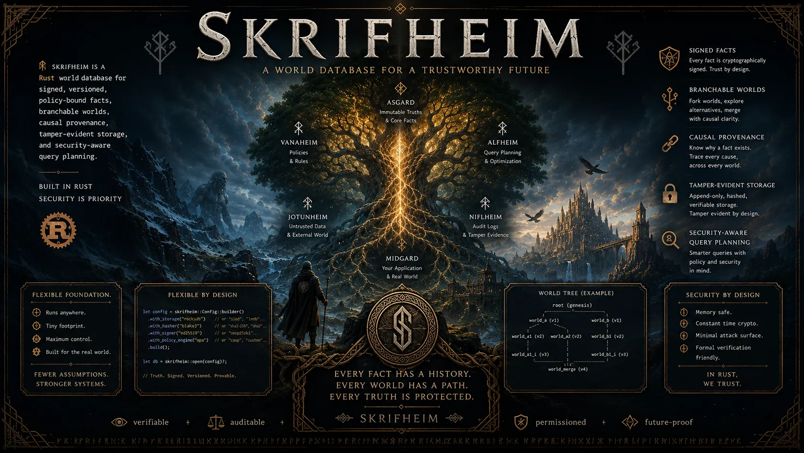

<p align="center">
  <b>Skrifheim is a Rust world database for signed, versioned, policy-bound facts, branchable worlds, causal provenance, tamper-evident storage, and security-aware query planning.</b><br>
  Built for causal provenance, tamper-evident history, strict release gates, and rootless containers.
</p>

<div align="center">
  <a href="docs/IMPLEMENTATION_PLAN.md">Implementation Plan</a>
  ·
  <a href="docs/VERSION_PLAN.md">Version Plan</a>
  ·
  <a href="docs/security-controls.md">Security Controls</a>
  ·
  <a href="docs/hyve-cluster-and-compliance-roadmap.md">Compliance And Hyve Roadmap</a>
  ·
  <a href="SECURITY.md">Security</a>
</div>

<br>

<p align="center">
  
</p>

# skrifheim

`skrifheim` is a world database.

The 1.0 target is a serious production-ready causal world-state database for
applications that need signed, versioned, policy-bound facts; branchable worlds;
provenance; classification-aware planning; tamper-evident storage; and CMS
integration through typed facts, atomic releases, sanitized projections, and AI
artifacts with provenance.

The project is currently at the `v0.7.0` implementation stop, pending pentest.
It is not a usable database engine.

`skrifheim` is licensed under the European Union Public Licence 1.2.

## What Works Today

### Repository Foundation

| Capability | Status | Notes |
| --- | --- | --- |
| Rust workspace | Active | Edition 2024, resolver `3`, Rust stable `1.96.0` pinned. |
| Core crate split | Active | Focused crates for core types, facts, worlds, policy, crypto envelopes, storage metadata, query planning, and CLI orchestration. |
| `no_std` core policy | Active | Library crates under `crates/` use `#![no_std]` and `#![forbid(unsafe_code)]`. |
| Dependency policy | Active | `cargo deny` policy denies wildcard external dependencies and unknown sources. |
| Security reporting | Active | Private-first vulnerability process in `SECURITY.md`. |
| Release notes | Active | `release-notes/RELEASE_NOTES_0.7.0.md` records scope, verification, and non-claims. |

### Initial Models

| Capability | Status | Notes |
| --- | --- | --- |
| Core IDs and labels | Scaffolded | Tenant, world, fact, entity, predicate, policy, transaction, actor, source, timestamp, and classification types. |
| Fact builder and validation | Scaffolded | Facts carry valid time, evidence, confidence, policy, labels, causal links, and signature sets. |
| World overlays | Scaffolded | Worlds support deterministic metadata identity, parent pointers, depth, added facts, hidden facts, fork, diff, promotion preflight, rollback preflight, and conflict categories. |
| Authority-aware policy context | Scaffolded | Subject, device, and workload context constrain clearance, compartments, releasability, output classification, and aggregate proof metadata. |
| Crypto-agile envelopes | Scaffolded | Algorithm IDs, crypto epochs, bounded signature sets, and key hierarchy metadata exist without locking the database to one permanent algorithm. |
| Storage metadata | Scaffolded | Immutable segment headers validate magic, version, transaction range, and body length. |
| Query planning primitives | Scaffolded | Query requests become policy decision plans for early read, causality, simulation, and context intents. |

### Tooling And Verification

| Capability | Status | Notes |
| --- | --- | --- |
| Local gate | Active | `scripts/checks.sh` runs formatting, shell syntax, doc links, release metadata, engineering policy, modularity, security policy, clippy, and tests. |
| `v0.7.0` release gate | Active | `scripts/release_0_7_gate.sh` runs local checks, dependency policy, RustSec audit, CLI startup, and rootless Podman smoke. |
| Rootless Podman | Active | `Containerfile` builds and runs the current CLI in a non-root runtime image. |
| Pentest stop rule | Active | Every version has a clean implementation stop before tagging. Root `PENTEST.md` is temporary findings input and must be removed after resolution. |
| Modularity gate | Active | Non-generated Rust files over 500 lines fail the local gate. |
| Engineering gate | Active | Core libraries must stay `no_std`, forbid unsafe code, and avoid `std` imports. |

### Planned Or Not Yet

| Capability | Status | Target |
| --- | --- | --- |
| Encryption control plane | Planned | `v0.7.0` through `v0.13.0`. |
| Durable WAL | Planned | `v0.14.0` through `v0.16.0`. |
| Immutable segment persistence | Planned | `v0.17.0` through `v0.20.0`. |
| Strict serializable transactions | Planned | `v0.21.0` through `v0.23.0`. |
| Native query parser and execution | Planned | `v0.25.0` through `v0.28.0`. |
| Rebuildable projections | Planned | `v0.29.0` through `v0.32.0`. |
| Crypto-agile manifest signatures | Planned | `v0.33.0`. |
| Audit proofs and backup/restore | Planned | `v0.34.0` through `v0.36.0`. |
| CMS release primitives | Planned | `v0.39.0` through `v0.40.0`. |
| AI artifact provenance | Planned | `v0.41.0`. |
| Distinctive security and truth features | Planned | Causal blast-radius invalidation, signed declassification proofs, AI derivation cones, and propagated confidence with mandatory access control are now tracked in the implementation and version plans. |
| Local-first worlds and mission capsules | Planned | `v0.42.0` through `v0.43.0`. |
| Fuzz/property baseline, operations, and hardening | Planned | `v0.44.0` through `v0.51.0`. |
| Standalone legal/compliance passports and placement foundations | Planned | `v0.52.0` through `v0.55.0`. |
| Production release candidate | Planned | `v0.56.0`. |
| Hyve multi-cell cluster fabric | Planned | `v1.1.0` and later. |

## Why skrifheim

- **Worlds instead of databases**: production, draft, simulation, audit,
  user-local, and mission worlds are first-class branchable states.
- **Facts instead of rows**: canonical state is signed, versioned, timed,
  evidence-bound, and policy-bound.
- **Security-aware planning**: classification, compartments, releasability,
  redaction, and rejection are database planning concerns, not application-side
  decoration.
- **Compliance-aware direction**: future instance, data, and operation
  passports let standalone reads, CMS access, exports, indexing, backup, AI
  processing, placement, replication, and failover respect signed law and
  compliance packs.
- **Tamper-evident direction**: WAL, immutable segments, manifests, signatures,
  and audit proofs are planned as the storage foundation.
- **AI is not truth**: AI output is planned as derived artifact state with
  provenance and review, never silent authoritative mutation.
- **Truth has blast radius**: causal links, declassification proofs, AI
  derivation cones, and propagated confidence are planned as first-class
  security controls.
- **Strict engineering posture**: core crates are `no_std`, unsafe code is
  forbidden, external crates require admission, and release stops require
  pentest review.

## Quick Start

Build the workspace:

```bash
cargo build --workspace
```

Run the current CLI:

```bash
cargo run -p skrifheim
```

Expected output:

```text
skrifheim 0.7.0
```

Run the normal local checks:

```bash
scripts/checks.sh
```

Run the `v0.7.0` release gate:

```bash
scripts/release_0_7_gate.sh
```

Skip the rootless Podman part only when the host cannot run containers:

```bash
SKRIFHEIM_SKIP_PODMAN=1 scripts/release_0_7_gate.sh
```

## Rootless Podman

Build and run the local container:

```bash
scripts/podman_smoke.sh
```

The current container only starts the CLI and prints build identity. Durable
database operation begins in later storage and runtime milestones.

## Workspace

| Crate | Purpose |
| --- | --- |
| `skrifheim` | Main crate and CLI entry point. |
| `skrifheim-core` | IDs, timestamps, labels, values, and shared errors. |
| `skrifheim-fact` | Signed policy-bound fact model. |
| `skrifheim-world` | World branch and overlay model. |
| `skrifheim-policy` | Classification and planner decision model. |
| `skrifheim-crypto` | Crypto-agile algorithm and signature envelopes. |
| `skrifheim-storage` | Storage format and tamper-evident metadata model. |
| `skrifheim-query` | Query planning primitives. |
| `xtask` | Project automation helper. |

## Security Posture

`skrifheim` is designed around military-security constraints:

- no god-mode database assumption,
- no unsafe code in core crates,
- no external dependencies without admission,
- no `std` in core library crates,
- no AI output as authoritative truth,
- no release tag without a clean stop and pentest resolution,
- no legal/compliance-sensitive access, derivation, backup, export, or movement
  without signed policy inputs and audit proof,
- no root `PENTEST.md` committed.

See [Engineering Policy](docs/engineering-policy.md), [Unsafe Policy](docs/unsafe-policy.md),
[Threat Model](docs/threat-model.md), and [Security Controls](docs/security-controls.md).

## Release Process

Each version has a clean implementation stop. When the version criteria are
done, the maintainer runs a pentest for the exact commit and writes temporary
findings to root `PENTEST.md`. Findings are fixed, `PENTEST.md` is removed, and
the gates are rerun before any permanent pentest report or tag.

Tags are created only when explicitly requested.

## Documentation

- [Implementation Plan](docs/IMPLEMENTATION_PLAN.md)
- [Version Plan](docs/VERSION_PLAN.md)
- [Engineering Policy](docs/engineering-policy.md)
- [Encryption Architecture](docs/encryption-architecture.md)
- [Hyve Cluster And Compliance Roadmap](docs/hyve-cluster-and-compliance-roadmap.md)
- [Security Controls](docs/security-controls.md)
- [Threat Model](docs/threat-model.md)
- [CMS 1.0 Target](docs/cms-1-0-target.md)
- [Toolchain Policy](docs/toolchain-policy.md)
- [Release Runbook](docs/release-runbook.md)
